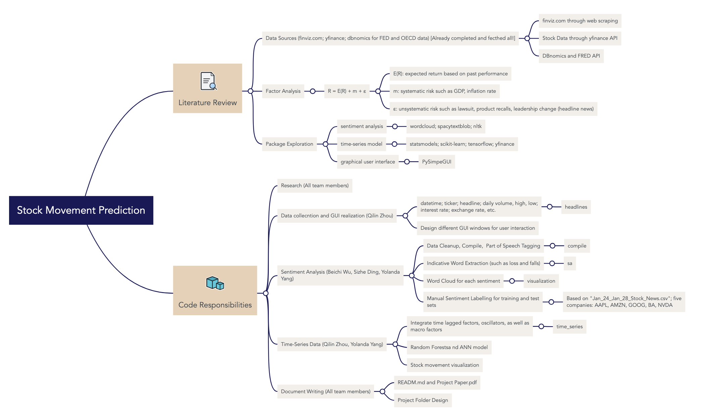

# 📈 S&P 500 Stock Movement Prediction with News Parsing

## 🌟 Overview
This repository hosts the code 🧑‍💻 and documentation 📄 for a machine learning project aimed at predicting stock market movements. We use various data sources 📊, factor analysis 🔍, and machine learning techniques 🤖, including **sentiment analysis and time-series forecasting**. We have also created a GUI 🎮 for users to interact with stock trend analysis.


## 📚 Table of Contents
- [Literature Review](#literature-review)
- [Package Exploration](#package-exploration)
- [Data Collection, Analysis, and Evaluation](#data-collection-analysis-and-evaluation)
- [Factor Analysis](#factor-analysis)
- [Development Process](#development-process)

## 📖 Literature Review
An investigation of existing forecasting models on stock movement prediction, as well as news sentiment analysis 📰

## 🔎 Package Exploration
Examination of various Python libraries 🐍 for data analysis and machine learning.
1. Data Science and Analysis: pandas, numpy, matplotlib, seaborn, plotly, kaleido
2. Machine Learning and Data Processing: scikit-learn, tensorflow, scikeras, joblib
3. Natural Language Processing: textblob, en_core_web_sm
4. Financial Data Analysis: yfinance, fredapi
5. Web Scraping: requests
6. Visualization and User Interface: PySimpleGUI, wordcloud 

## 🗂️ Data Collection, Analysis, and Evaluation
Details the data sources and analytical methods used in the project.

### 🛠️ Data Sources
- **Headline News**: Scraped from finviz 📈 https://finviz.com/.
- **Stock Data**: Collected through Yahoo Finance API 📈.
- **Economic Indicators**: Fetched from DBnomics API and Federal Reserve Economic Data API for macro-economic factor analysis 🌐.

## 📈 Factor Analysis (Company-Specific)
Explores the relationship between expected returns and systematic risk, for each ticker in yfinance database.
- **Sentiment Analysis**: Implemented to understand market sentiment's impact on stock movements 💬.
- **Time-Series Data**: Analyzed to capture price patterns and trends from 2000 to now, on a daily frequency to the train three time-series ML models, with 5 years as a cycle for backtesting **Random Forests, ANN, LSTM**⏳.
  
## ❓ Target
- **Empower retail investors by integrating Artificial Intelligence (AI) tools**, including traditional Artificial Neural Networks (ANN) and Recurrent Neural Networks (RNN), to bridge the cognitive or knowledge gap in financial markets. These technologies aim to augment investors' decision-making processes with advanced, data-driven insights.
- Enhance the Efficient Market Hypothesis perspective by incorporating sentiment analysis of news headlines. This approach tests the impact of public sentiment on company valuations, suggesting that markets might not instantly reflect all available information, particularly in the short term. Through sentiment analysis, we can identify **potential lagged effects of public opinion on stock prices**.
- Utilize visualization tools like **WordCloud** to offer quick and intuitive analyses of news trends. This method enables investors to efficiently comprehend the overall sentiment and topical focus across multiple companies, **streamlining the process of analyzing stock trends concurrently**.
  
## ⏰ Time Series Prediction Results Overview (Binary Classification Problem)
**Tomorrow's stock movement prediction  Up or Down?**
### Training Period Performance for AAPL (2000-01-01 to 2024-03-03)
| Model | Accuracy | Precision | Test Positive Percentage | Recall | F1 Score |
|-------|----------|-----------|--------------------------|--------|----------|
| RF    | 0.5554   | 0.5721    | 0.5499                   | 0.7605 | 0.6529   |
| LSTM  | 0.5421   | 0.5421    | 0.5421                   | 1.0000 | 0.7031   |
| ANN   | 0.5510   | 0.5505    | 0.5499                   | 1.0000 | 0.7101   |

(note: Test Positive Percentage means the percentage of positive cases in the original data)
### Beck Testing Performance
| Model | Accuracy | Precision | Test Positive Percentage | Recall | F1 Score |
|-------|----------|-----------|--------------------------|--------|----------|
| RF    | 0.4901   | 0.5370    | 0.5279                   | 0.2484 | 0.3397   |
| LSTM  | 0.5385   | 0.5385    | 0.5385                   | 1.0000 | 0.7000   |
| ANN   | 0.5279   | 0.5280    | 0.5279                   | 0.9989 | 0.6908   |

From the results on AAPL stock above, we have **slightly better prediction than baseline distribution** (i.e., comparing precision with test positive percentage). In the training, with default threshold 0.5, LSTM and ANN generally had a relatively high recall with low precision. On the other hand, Random Forests have better precision with low recall. We suggest users to change the threshold and train deeper networks for better results.

## 📰 Sentiment Analysis and Word Cloud (Vocab-based Classification and Visualization)


By utilizing news headlines marked as **Negative High and Positive Low** through sentiment analysis (respectively labeled as positive and negative in wordcloud), it is possible to more accurately reflect the media's perspective on a stock while also enhancing the precision of word cloud coloring.

## 🌟 Future Improvement
- **GUI design**: we currently utilize **the best three machine learning models pre-trained on Apple Stock** data streamlines the user experience by eliminating the need for daily model retraining. Future improvement may be thread implementation and training speed optimization.
- **News Sentiment Integration to price-only model**: due to time constraints, the application currently handles the analysis of news sentiment and its impact on stock prices separately from the direct stock movement forecasts. Future improvement may be expanded news scraping, **broadening the scope of news scraping to include sources beyond those offered by Finviz**, which typically covers news up to only five days.
  
## How to Use?
### 1.1 File Structure
```python
sp500
    compile
        __init__.py
        cleanup.py
        pos.py
    headlines
        __init__.py
        app.py
        displayer.py
        scraper.py
    sa
        data
        __init__.py
        analyzer.py
        sa.py
        test.py 
        train_classifier.py
    time_series
        __init__.py
        visualization
            best_model_viz.py
            company_profile.py
            macro_indicators_viz.py
            stock_movement.py
        price_model.py
        time_series_preprocessing.py
    visualization
        visualization
        __init__.py
        create_word_clooud.py
        datatypes.py
        wordcloud_in_logo.py
poetry.lock
pyproject.toml
README.md

```
### 1.2 General User Instruction
This guide outlines how to configure and run our TensorFlow model GUI using Anaconda and Poetry, focusing on compatibility with Python versions supported by TensorFlow (<3.12).

**Prerequisites** 
Anaconda and Poetry installed on your system. 

**FRED** key needed for prediction model access.

1. Verify Anaconda's Python Installation
```shell
which python
```
2. Configure Poetry to Use Anaconda's Python 
```shell
poetry env use /path/to/anaconda3/bin/python
```
3. Installing Dependencies
```shell
poetry install
```
4. Running the GUI
```shell
poetry run python sp500/headlines/app.py
```


### 1.2 Specific User Instruction
1. Clone repository ```git clone git@github.com:qilinzho56/SP500.git``` in terminal
2. Run ```pip install --user -U nltk``` in terminal
3. Run ```poetry install``` to install necessary packages in terminal
4. Activate virtual environment by running ```poetry shell``` in terminal
5. Run the command line ```poetry run python sp500/headlines/app.py``` in terminal to interact with our application
    If you are using a Mac with an M1, you may encounter tensorflow installation problems (zsh: illegal hardware instruction). Please refer to https://stackoverflow.com/questions/65383338/zsh-illegal-hardware-instruction-python-when-installing-tensorflow-on-macbook 


## Reference
- D. Shah, H. Isah and F. Zulkernine, "Predicting the Effects of News Sentiments on the Stock Market," 2018 IEEE International Conference on Big Data (Big Data), Seattle, WA, USA, 2018, pp. 4705-4708.
- Hutto, C.J. & Gilbert, E.E. (2014). VADER: A Parsimonious Rule-based Model for Sentiment Analysis of Social Media Text. Eighth International Conference on Weblogs and Social Media (ICWSM-14). Ann Arbor, MI, June 2014.
- Loughran, T. and McDonald, B. (2011), ``When Is a Liability Not a Liability? Textual Analysis, Dictionaries, and 10-Ks.'' The Journal of Finance, 66: 35-65.
- S. Mohan, S. Mullapudi, S. Sammeta, P. Vijayvergia and D. C. Anastasiu, "Stock Price Prediction Using News Sentiment Analysis," 2019 IEEE Fifth International Conference on Big Data Computing Service and Applications (BigDataService), Newark, CA, USA, 2019, pp. 205-208.
