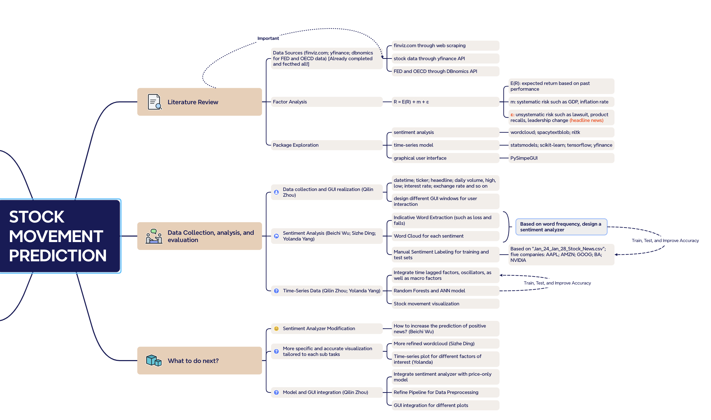

# S&P 500 Stock Movement Prediction

## Overview
This repository hosts the code and documentation for a machine learning project aimed at predicting stock market movements. We use various data sources, factor analysis, and machine learning techniques, including sentiment analysis and time-series forecasting.

## Table of Contents
- [Literature Review](#literature-review)
- [Package Exploration](#package-exploration)
- [Data Collection, Analysis, and Evaluation](#data-collection-analysis-and-evaluation)
- [Factor Analysis](#factor-analysis)
- [Development Process](#development-process)
- [What to Do Next?](#what-to-do-next)

## Literature Review
A thorough investigation of existing research on stock movement prediction methodologies.

## Package Exploration
Examination of various Python libraries for data analysis and machine learning.

## Data Collection, Analysis, and Evaluation
Details the data sources and analytical methods used in the project.

### Data Sources
- **Stock Data**: Collected through Yahoo Finance API.
- **Economic Indicators**: Fetched from DBnomics API for FED and OECD data.

## Factor Analysis
Explores the relationship between expected returns and systematic risk.
- **Sentiment Analysis**: Implemented to understand market sentiment's impact on stock movements.
- **Time-Series Data**: Analyzed to capture patterns and trends over time.

## Development Process
Documentation of the development steps, including data collection and GUI creation.

## What to Do Next?
Outlines the forthcoming steps in the project's lifecycle.

## Contributors
- Data Collection and GUI Realization: Qilin Zhou
- Sentiment Analysis: Beichi Wu, Sizhe Ding, Yolanda Yang
- Time-Series Data: Qilin Zhou, Yolanda Yang

